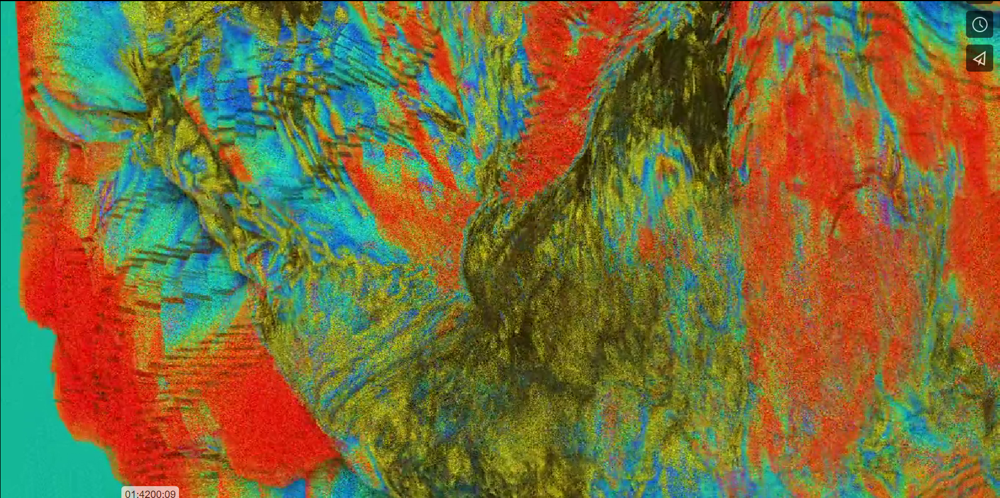
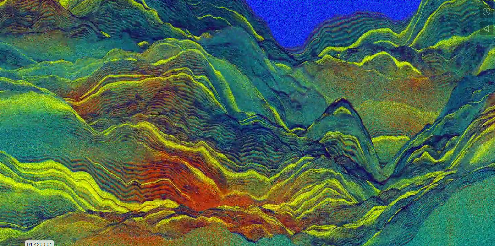
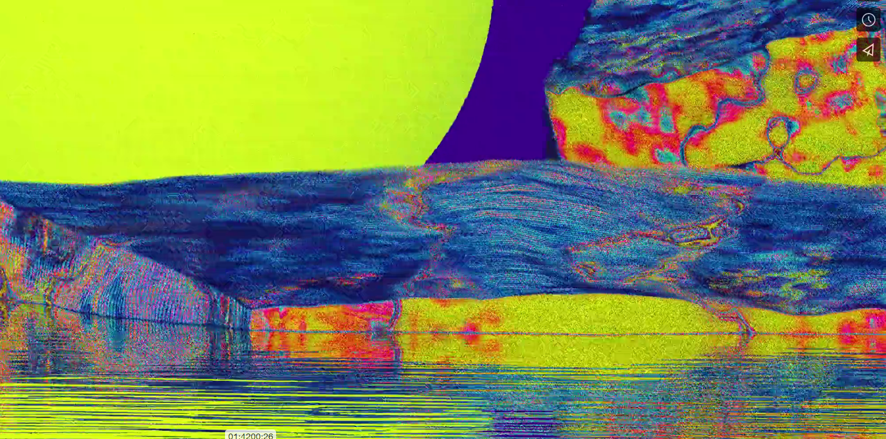
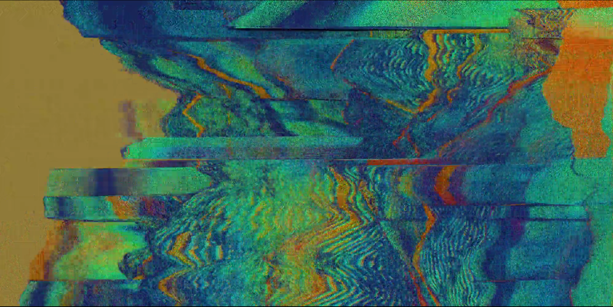

# ygon0163_9103_tut3
Design Programming
## QUIZ8
__Part1 Imaging Technique Inspiration__
__Part2 Coding Technique Exploration__

### Imaging Technique Inspiration
- __Procedural Graphics-Particle art__
  - inspired by sand painting and particle art exhibition I've seen before
   ###### Sand painting

   ###### Particle art

  - incorporate aspect and why beneficial

#### image examples
###### Fine arts
- illustration

 _Behance-Bjørg-Elise Tuppen_

###### Special effects animation
- illustration

 _Vimeo-GaoYang_
 
 _Vimeo-GaoYang_
 
 _Vimeo-GaoYang_
 
 _Vimeo-GaoYang_

### Coding Technique Exploration
- __name__
  - how this code helps

  - incorporate aspect and why beneficial

#### code examples
###### Example1
- illustration

 _Imagesource_

- example code
[Link Text](https://www.google.com
Links to an external site.)
 _Codesource_

> This is a blockquote.